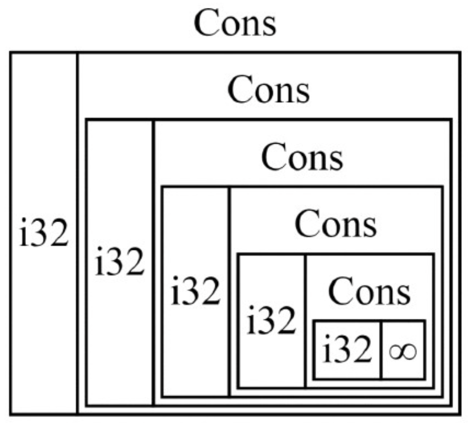
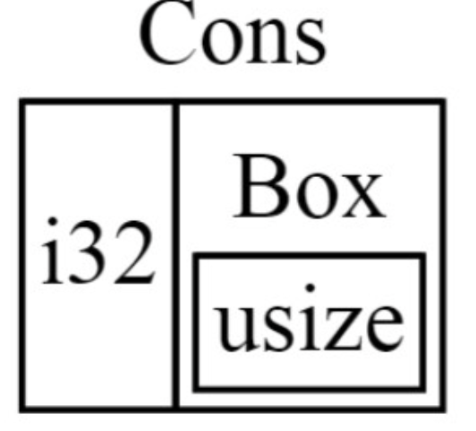
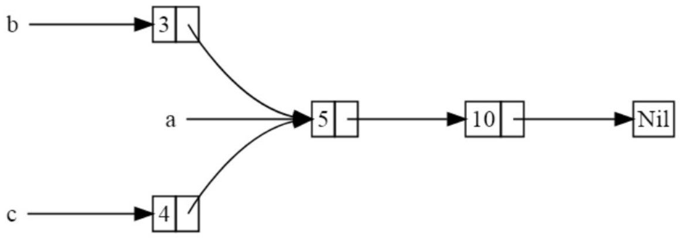

**指针**
指代包含内存地址的变量。引用，用"&"表示，就是指针。
**智能指针**
是一些数据结构，指针+元数据+附加功能。属于一种 _设计模式_。
_引用计数_（reference counting）：通过记录所有者的数量，使一份数据被多个所有者同时持有，在没有任何所有者时自动清理数据。

**指针（引用）和智能指针的区别**
（1）智能指针 = 指针（引用） + 元数据 + 附加功能；
（2）引用只是借用数据的指针，大多数智能指针本身就拥有他们指向的数据。（因为是结构体，包含该数据和指向数据的指针）

**常见的智能指针**
String、Vec<T>：他们拥有一片内存区域允许用户操作，有元数据（容量等），提供额外功能或保障（String保证数据为合法UTF8编码）

**智能指针和结构体的区别**
智能指针 = 实现了 _Deref_ 和 _Drop_ 这两个trait的结构体。
_Deref_ ：使得智能指针结构体实例拥有与引用一致的行为，使得编写的代码可以同时适用于引用和智能指针。
_Drop_ ：自定义智能指针离开作用域时运行的代码。

**标准库中常见的智能指针**
Box<T>：用于在堆上分配值
Rc<T>：允许多重所有权的引用计数类型
Ref<T>/RefMut<T>：在运行时而不是编译时执行借用规则的类型，可以通过RefCell<T>访问。 ？？？

**内部可变性模式**
不可变类型暴露能改变自己内部值的API。

###### 使用Box<T>在堆上分配数据
装箱（box）使我们可以将数据存储在堆上，并在栈上保留一个指向堆数据的指针。
**使用场景**
（1）有一个无法在编译时确定大小的类型，但想在一个要求固定尺寸的上下文环境中使用。
（2）需要传递大量数据的所有权，但又不希望产生大量数据的复制行为。
（3）希望拥有一个实现了指定trait的类型值（trait对象），又不关心具体的类型。（第17章展开讲解，【使用trait对象来存储不同类型的值】）

###### 使用Box<T>在堆上存储数据
查看：cp15_intelligent_pointer/box_test.rs:5

**使用装箱定义递归类型**
rust必须在编译时知道每一种类型占据的空间大小。因此要创建不确定的类型时，需要通过装箱创建。

**rust计算一个非递归类型的大小**
以cp6_enum::message::Message为例，rust会遍历枚举，并计算占用最大空间的大小，作为Message需要的空间。
对于cp15_intelligent_pointer::box_test::List，rust遍历进行计算的过程如下：
大小为i32的大小 + List的大小；再遍历List的大小，为i32 + List的大小。。。则会获取无穷大

此时需要使用Box<T>将大小固定下来，此时枚举的大小即为

###### 使用Deref trait将智能指针视作常规引用
主要内容：
常规引用的解引用效果；
自己编写类似与Box<T>的类型；
通过Deref使智能指针拥有解引用功能；
rust的解引用转换功能；

**常规引用和Box的解引用效果**
查看cp15_intelligent_pointer::pointer::quote(),可以发现Box和普通引用一样，可以通过*获取引用的值。

**自定义智能指针**
查考cp15_intelligent_pointer::mybox::quote()。
其中自定义了MyBox，并实现了Deref，才可以和Box一样可以使用*获取引用值。

**函数和方法的隐式解引用转换**
解引用转换（deref coercion）是rust为函数和方法的参数提供的一种便捷特性。
当类型T实现了Deref trait时，会将T的引用转换为T.deref()。
当我们把特定类型的值引用作为参数传递给函数或方法，但传入的类型与参数类型不符合时，解引用会自动发生。

参考：cp15_intelligent_pointer::mybox::hello_mybox();

只要代码涉及的类型实现了Deref，rust会自动解析类型尝试通过插入Deref::deref来获得与入参类型匹配的引用，这一过程会在编译时完成，
因此解引用转换不会在运行时产生任何性能开销。

**解引用转换与可变性**
Deref会重载不可变引用的*运算符，类似DerefMut能够重载可变引用的*运算符。
rust解引用转换的三种情形：
（1）当T:Deref<Target=U>时，允许&T转换为&U
（2）当T:DerefMut<Target=U>时，允许&mut T转换为&mut U
（3）当T:Deref<Target=U>时，允许&mut T转为&U
关于情形三，可变引用可以转为不可变引用，但是不可变引用无法转为可变引用。因为可变引用要求是唯一的引用，否则编译会失败。

###### 借助Drop在清理时运行代码
Drop::drop即为析构函数。
可以为任何类型实现Drop，用于变量离开作用域时执行自定义操作，如释放文件、网络等资源。
Box<T>通过Drop释放装箱指针的堆内内存。

**使用std::mem::drop提前丢弃值**
使用智能指针管理锁时，会遇到希望强制运行drop方法提前释放锁，从而允许同一作用域其他代码获取锁。
rust不允许手动调用Drop::drop，（因为结尾会自动调用一次，对同一值清理两次会导致释放错误）
但是可以通过标准库中的std::mem::drop提前清理某个值。

###### 基于引用计数的智能指针Rc<T>
某些场景，单个值可能同时被多个所有者持有。例如图结构中，多个边可能指向相同节点，
而这个节点从概念上同时属于所有指向他的边。一个节点只要有任意指向他的边，就不该被清理掉。
Rc<T>来支持多重所有权，reference counting的缩写。

Rc<T>使用场景：
堆上的一些数据分享给多个程序的多个部分同时使用，在编译期无法确定哪个部分会最后释放这些数据。只能用于单线程场景。
如果可以确定哪个部分最后释放数据，只需要把数据所有权赋予最后释放数据的部分即可。

**使用Rc<T>共享数据**
示例：创建两个列表，共同享有第三个列表的所有权。

**克隆Rc<T>会增加引用计数**
通过cp15_intelligent_pointer::rc::rc_local() 可以看到Rc引用变化。
Rc<T>通过*不可变引用*共享只读数据，不允许持有多个可变引用，因为多个指向同一区域的可变借用会导致数据竞争和数据不一致性。
实际开发中，允许数据可变可以通过 内部可变性模式 及RefCell<T>类型，该类型可以与Rc<T>联合使用绕开不可变限制。

**RefCell<T>和内部可变性模式**
内部可变性是rust设计模式之一，允许你在只持有不可变引用的前提下对数据进行修改。
内部可变性模式在数据结构中使用unsafe代码绕开rust正常的可变性借用规则。

**使用RefCell<T>在运行时检查借用规则**
借用规则：
（1）在任何给定时间里，要么只有一个可变引用，要么只能拥有任意数量的不可变引用。
（2）引用总是有效的。
对于使用一般引用和Box<T>的代码，rust会在编译阶段遵循上述规则，对于RefCell<T>代码，rust只会在运行时检查这些规则，
并在违反规则时触发panic
RefCell<T>只能用于单线程场景中。

如何选择Box<T>/Rc<T>/RefCell<T>
Rc<T>允许一份数据有多个所有者，Box<T>和RefCell<T>只能有一个所有者；
Box<T> 编译时检查 可变或不可变借用
Rc<T> 编译时检查 不可变借用
RefCell<T> 运行时检查 可变或不可变借用

**内部可变性：可变地借用一个不可变值**
一开始查看示例：cp15_intelligent_pointer::refcell_test::test::it_sends_an_over_75_percent_warning_message_no_works

通过RefCell<T>改写查看cp15_intelligent_pointer::refcell_test::test::it_sends_an_over_75_percent_warning_message
RefCell<T>的borrow和borrow_mut方法可以获取对象的&和&mut，这两个方法返回的是Ref<T>和RefMut<T>
RefCell.borrow使得不可变引用数量加一，RefCell.borrow_mut使得可变引用数量加一。但是同时只能拥有多个不可变引用和一个可变引用。
如果RefCell拥有多个可变引用，运行时会触发panic

**将Rc<T>和RefCell<T>结合使用来实现一个拥有多重所有权的可变数据**
Rc<T>允许多个所有者持有同一数据，但智能提供不可变访问。如果在Rc<T>内存储RefCell<T>，就可以定义出拥有多个所有者且能够进行修改的值。
查看例子：cp15_intelligent_pointer::refcell_test::test::listV3_rc_refcell();
与RefCell<T>相似的还有Cell<T>和Mutex<T>:
RefCell<T>：通过引用实现内部可变性
Cell<T>:通过复制实现内部可变性
Mutex<T>：跨线程场景下的内部可变性

###### 循环引用会造成内存泄露
如果使用Rc<T>和RefCell<T>，可以通过构造相互引用的环状实例，造成内存泄露。
查看示例：cp15_intelligent_pointer::circle_ref::test::circle_ref(),
链表类型为RefCell<Rc<T>>
链表a数据为{5, Nil};
链表b数据为{10,&a};
如果此时a通过内部可变性，把a.tail修改为指向b，则会造成循环引用。
如果代码中存在RefCell<T>包含Rc<T>，或者其他联用了内部可变性+引用计数指针情况下，可能会出现循环引用。

###### 使用Weak<T>代替Rc<T>避免循环引用
可以避免产生循环引用。
Rc::clone会增加实例的strong_count引用数；
Rc::downgrade(&xx)会返回Weak<T>智能指针，并使weak_count引用数+1。Rc<T>执行清理操作前并不会要求weak_count数为0.

示例：cp15_intelligent_pointer::weak_ref::test::node_test()
场景：定义了Node的树形节点，每个节点包含多个child。同时拥有一个parent，
Node需要拥有子节点的所有权，但是不应该拥有父节点的所有权。因为父节点销毁后，子节点也需要给同时销毁。所以此时指向parent的应该是一个弱引用。
指向children的应该是强引用。

