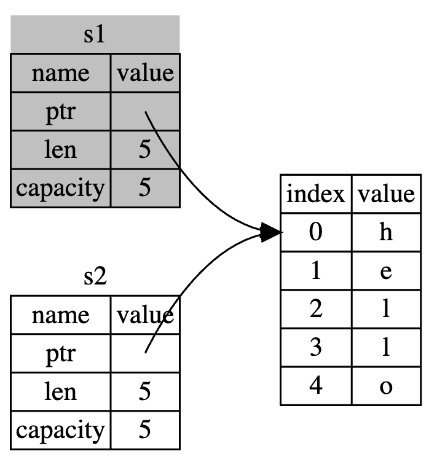
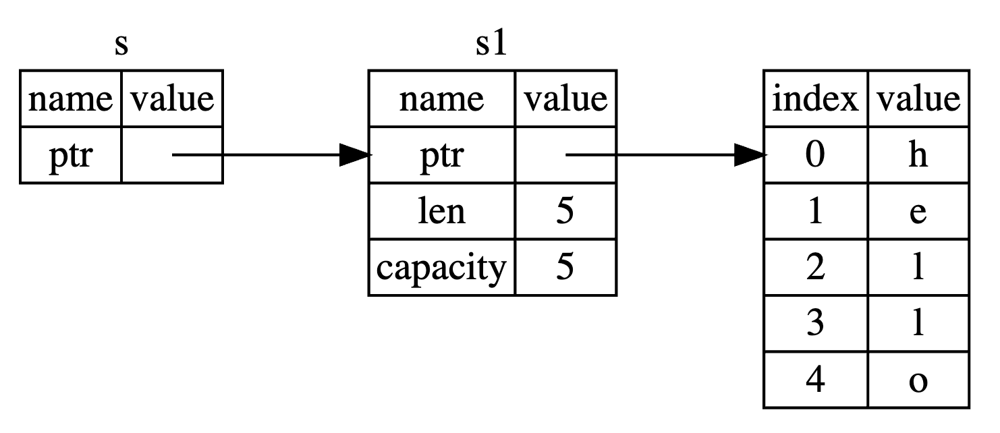
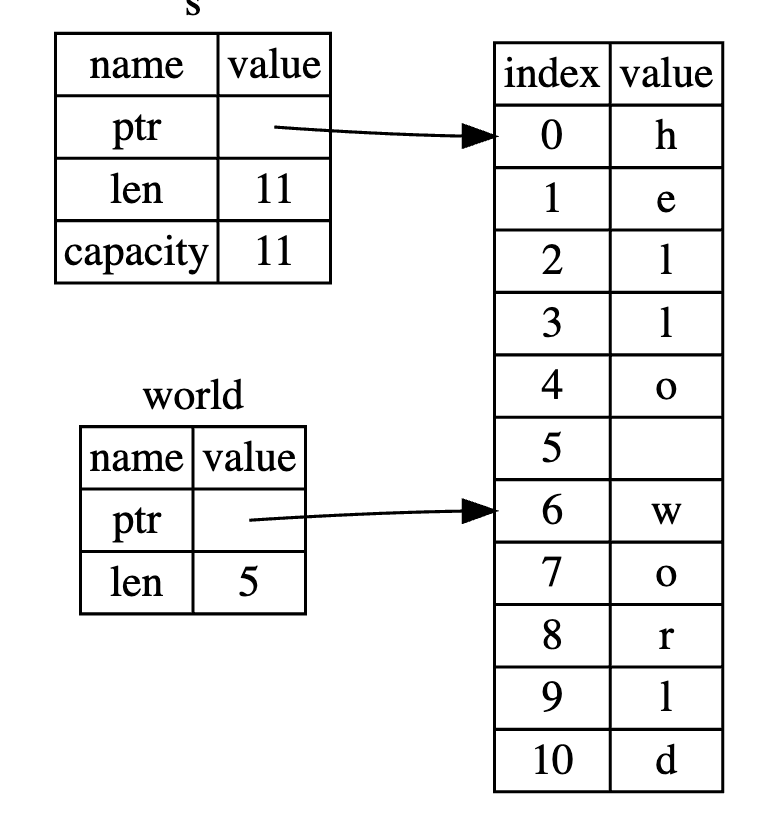

rust是静态语言，所有的变量在创建时的大小必须已知，（可能因为是在栈上？所有存储在栈上的数据必须大小已知且固定）
**所有权规则**
Rust中每一个值都有一个对应的变量作为它的所有者。
同一时间内，值有且只有一个所有者。
当所有者离开自己的作用域时，持有的值会被释放。

**变量与数据交互的方式**
（1）移动move
`
let x = 5;
let y = x;
`
针对基础类型，其实此时也是5的值复制了一份，所有者为y。所有x和y在此处都可以使用。但是对于String，下面不成立：
`
let s = String::from("test");
let s1 = s;
`
原因如图所示：

示例：cp4_ownership::test::data_move().

（2）克隆clone
针对String智能指针这种类型，不仅要复制栈上数据，也要复制堆上数据，即为深拷贝。
`
let s1 = String::from("test");
let s2 = s1.clone();
`
此时s1和s2才都有效。
示例：cp4_ownership::test::data_clone()

当变量进入函数时也一样，
基本类型值传递，所有权不受影响（其实是栈上复制了一份新的数据）。
智能指针类型值传递，入参的所有权会被释放（除非再作为返回值返回）。此时需要指针传递。

reference和borrow
reference（引用）的含义如下图所示：

`
fn main {
    fn calculate_length(s: &String) -> usize {
        s.len()
    } // s离开作用域，但是不拥有String的所有权，所以不影响String的使用
}
`
我们称 _获取引用_ 作为 _函数参数_ 为 _borrow_(借用)
borrow同样有不可变借用和可变借用。在特定作用域内，特定数据只能有一个可变借用。（使用智能指针可有多个可变借用）

数据竞争出现的条件。
（1）两个或更多指针同时访问同一数据
（2）至少有一个指针被用来写入数据
（3）没有同步数据访问的机制

为了防止数据竞争，对于引用有如下规则：
（1）任意时间，要么只能有一个可变引用，要不只能有多个不可变引用
（2）引用必须总是有效的

**字符串slice（&str）**
字符串字面值就是slice，即为&str，因此字符串字面值是不可变的。
slice是对String部分的引用，保存了指向String的指针和长度。如下如所示：

`

